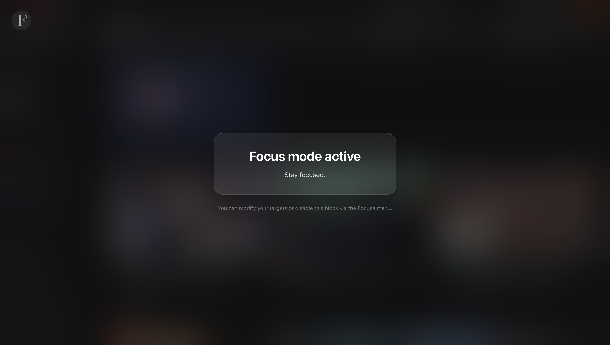

# Focusa
A Chrome extension for focusing on your goals.
## Installing

Since **Focusa** is an open-source extension, you can easily load it into any Chromium-based browser in just a few seconds using **Developer Mode**.

1. Download the latest `Focusa-v1.0.zip` file and extract it on your computer.
3. Open your browser and go to the extensions manager:
   * **Chrome:** Navigate to `chrome://extensions/`
   * **Microsoft Edge:** Navigate to `edge://extensions/`
4. Toggle **Developer mode** on (found in the top-right corner on Chrome, or bottom-left on Edge).
5. Click **Load unpacked** (or **Load unpacked extension**).
6. Select the extracted `Focusa` folder. Done!

